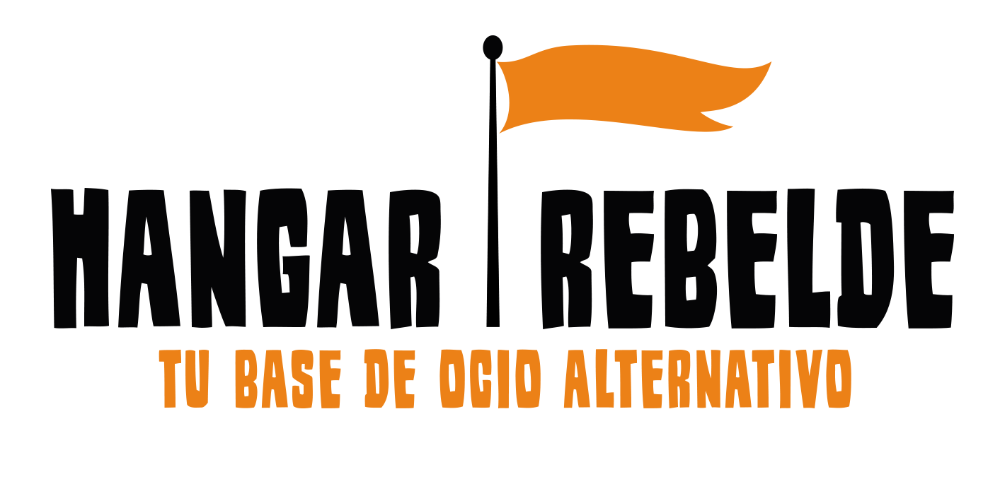

# HANGAR REBELDE

## La app ecommerce para la tienda de comics

## About Laravel

Laravel is a web application framework with expressive, elegant syntax. We believe development must be an enjoyable and creative experience to be truly fulfilling. Laravel takes the pain out of development by easing common tasks used in many web projects, such as:

- [Simple, fast routing engine](https://laravel.com/docs/routing).
- [Powerful dependency injection container](https://laravel.com/docs/container).
- Multiple back-ends for [session](https://laravel.com/docs/session) and [cache](https://laravel.com/docs/cache) storage.
- Expressive, intuitive [database ORM](https://laravel.com/docs/eloquent).
- Database agnostic [schema migrations](https://laravel.com/docs/migrations).
- [Robust background job processing](https://laravel.com/docs/queues).
- [Real-time event broadcasting](https://laravel.com/docs/broadcasting).

Laravel is accessible, powerful, and provides tools required for large, robust applications.

## Learning Laravel

Laravel has the most extensive and thorough [documentation](https://laravel.com/docs) and video tutorial library of all modern web application frameworks, making it a breeze to get started with the framework.

If you don't feel like reading, [Laracasts](https://laracasts.com) can help. Laracasts contains over 1500 video tutorials on a range of topics including Laravel, modern PHP, unit testing, and JavaScript. Boost your skills by digging into our comprehensive video library.

## Laravel Sponsors

We would like to extend our thanks to the following sponsors for funding Laravel development. If you are interested in becoming a sponsor, please visit the Laravel [Patreon page](https://patreon.com/taylorotwell).

### Premium Partners

- **[Vehikl](https://vehikl.com/)**
- **[Tighten Co.](https://tighten.co)**
- **[Kirschbaum Development Group](https://kirschbaumdevelopment.com)**
- **[64 Robots](https://64robots.com)**
- **[Cubet Techno Labs](https://cubettech.com)**
- **[Cyber-Duck](https://cyber-duck.co.uk)**
- **[Many](https://www.many.co.uk)**
- **[Webdock, Fast VPS Hosting](https://www.webdock.io/en)**
- **[DevSquad](https://devsquad.com)**
- **[Curotec](https://www.curotec.com/services/technologies/laravel/)**
- **[OP.GG](https://op.gg)**
- **[CMS Max](https://www.cmsmax.com/)**
- **[WebReinvent](https://webreinvent.com/?utm_source=laravel&utm_medium=github&utm_campaign=patreon-sponsors)**

## Contributing

Thank you for considering contributing to the Laravel framework! The contribution guide can be found in the [Laravel documentation](https://laravel.com/docs/contributions).

## Code of Conduct

In order to ensure that the Laravel community is welcoming to all, please review and abide by the [Code of Conduct](https://laravel.com/docs/contributions#code-of-conduct).

## Security Vulnerabilities

If you discover a security vulnerability within Laravel, please send an e-mail to Taylor Otwell via [taylor@laravel.com](mailto:taylor@laravel.com). All security vulnerabilities will be promptly addressed.

## License

The Laravel framework is open-sourced software licensed under the [MIT license](https://opensource.org/licenses/MIT).
# HangarRebelde

####

# AMASÓ ECOMMERCE

## La app para conectar artesanos y productores locales con sus clientes.

# Requisitos técnicos

-   Laravel 8
-   PHP 7.4
-   composer 1.10.15

# Instalación

`composer install`

`npm install && npm run dev`

`php artisan migrate`

## Running app

`php artisan serve`

## Running Tests

`php artisan test`

## Running PHP Mess Detector

`vendor/bin/phpmd ./app text cleancode,unusedcode,codesize,design,naming`

## Metodología de trabajo

-   TDD
-   Agile
-   Scrum
-   Pair programming
-   CI/CD

### Kanban link

### Heroku link

http://amaso.herokuapp.com/

### Proyecto creado en equipo durante el Bootcamp Factoria F5.

Integrantes:

-   Carmen Pérez.
-   Laura Bassani.
-   Estefanie Garcia L.
-   Joaquim Francès.

Aplicación creada con la idea de poder ofrecer una via digital a los pequeños productores locales que quieren vender sus productos a clientes cercanos.

 [Usuarios.](#usuarios)  
 [Artesanos.](#artesanos)  
 [Administradores.](#adminstradores)

### Usuarios

-   En la aplicación los usuarios pueden ver tanto los artesanos locales como sus productos.
-   Pueden comprar productos.
-   Pueden acceder a su perfil con el historial de sus compras.

### Artesanos

-   Los artesanos pueden subir sus productos para la venta.
-   Editar y eliminar productos.
-   Editar y eliminar su perfil de artesano.
-   Pueden ver sus productos vendidos con los datos del comprador.

### Adminstradores

-   Los administradores disponen de un panel de control donde podrán visualizar a los artesanos que se  hayan inscrito en la aplicación.
-   Los administradores pueden eliminar los perfiles de los artesanos.

## Aprendizajes

-   Plantear un proyecto desde scratch.
-   Implementar cambios incrementales.
-   Trabajar con CI/CD.
-   Implementar GitHub Actions.
-   Patrón Repositorio.
-   Creación de vistas por componentes.

## Siguientes pasos

- [x] Incluir una API para la pasarela de pago.
- [x] Implementar patrón repositorio.
- [ ] Vincular a cada usuario un carrito que se destruye luego de la compra.
- [x] Implementar transacciones para las bases de datos.
- [ ] Utilizar sesiones que reserven los productos durante un tiempo determinado en cada carrito.
- [ ] Utilizar Docker.
- [x] Crear las vistas por componentes.
- [x] Crear perfil del usuario con su historial de compra.

